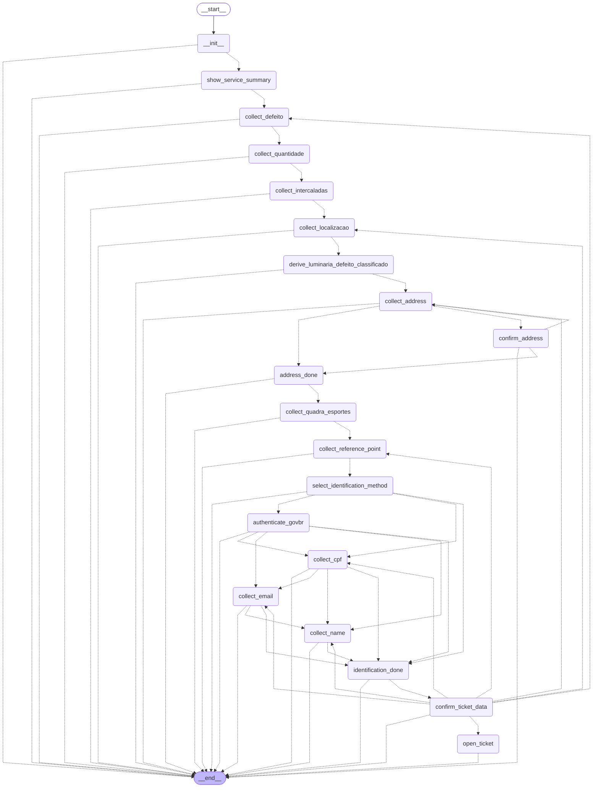

<!-- section:toc -->

Table of Contents:

- Install: 35 <!-- section:install -->
- LLM-driven (the engine side): 57 <!-- section:llm-driven -->
- Quickstart: 76 <!-- section:quickstart -->
- Real backends: 100 <!-- section:real-backends -->
- Error correlation: 117 <!-- section:error-correlation -->
- CLI: 140 <!-- section:cli -->
- What it compiles: 160 <!-- section:what-it-compiles -->
- Example: reparo de luminária: 180 <!-- section:example -->
    - The flowspec/2 document: 187 <!-- section:example-document -->
    - Compiled LangGraph: 797 <!-- section:example-compiled-langgraph -->
- Layout: 913 <!-- section:layout -->
- Status: 939 <!-- section:status -->

<!-- /section:toc -->

# flowspec2

**A JSON conversational-flow format that compiles to a [LangGraph](https://langchain-ai.github.io/langgraph/) `StateGraph` at runtime.**

You write one self-contained JSON document per service flow. A running agent loads it and `flowspec2` compiles it into an executable `StateGraph[ServiceState]` — the flow becomes immediately callable as a tool/subgraph. The design comes from the Prefeitura do Rio WhatsApp bot's `multi_step_service` framework; this repo is a clean, self-contained, dependency-light reimplementation of the *format* and its *runtime compiler*.

> **One idea — the boundary is the closed value-domain.** The JSON pins the **rails** (states, value-domains, transitions, guards, tool bindings, interrupts, idempotency, guardrails); the LLM reasons and acts **freely within** them (which flow to enter, extracting the closed token from free text/voice/photo, phrasing, side actions). The LLM structurally *cannot* invent a transition, skip a required slot, or widen a value-domain.

flowspec2 is deliberately specialized rather than a replacement for a general
workflow language. See the [prior-art comparison](docs/PRIOR_ART.md), the
[compatibility profiles](docs/COMPATIBILITY.md), and the
[interoperability decision](docs/adr/0001-interoperability-boundaries.md).

<!-- section:install -->

## Install

```bash
uv sync                      # install the runtime package
make ci                      # locked lint, format check, type checks, and offline tests
uv run python examples/simulate.py   # 6 real citizen conversations over the HTTP backends
```

Development tooling is pinned in `pyproject.toml` and `uv.lock`. `make lint`,
`make typecheck`, and `make test` run independently; `make format` applies the
configured Ruff fixes and formatter. Every target uses the locked `dev` extra
without loading environment files. Pyright uses its packaged distribution and
a signed, minimal Distroless Node runtime pinned by digest. The checker
container runs without a shell or package manager and has no network,
capabilities, writable root filesystem, or writable project mount. Docker is
therefore the only additional prerequisite for `make typecheck` and `make ci`.

`examples/simulate.py` prints turn-by-turn transcripts of the reparo_luminaria flow as realistic conversations over the real HTTP backends (deterministic geocoder + SGRC via `MockTransport`): the production WhatsApp-Flow path, an address correction, gov.br auth, the praça→quadra branch, an SGRC outage (503 → retryable → recovers), and a duplicate submission that fires the side effect exactly once.

<!-- /section:install -->
<!-- section:llm-driven -->

## LLM-driven (the engine side)

The simulations above feed already-extracted tokens. To exercise the *non-deterministic execution* side — a real LLM doing the work the format leaves open — there's a Gemini driver (`flowspec2.llm.GeminiAgent`, model `gemini-2.5-flash`, the model the production bot uses):

```bash
uv sync --extra llm                       # google-genai
export GEMINI_API_KEY=...
uv run python examples/llm_bot.py         # the citizen speaks free text; the LLM routes + extracts
```

The LLM does exactly two non-deterministic jobs, the rails hold everything else:
- **route** — decide whether the citizen's free-text opener enters the flow (from `route.description`);
- **extract** — read the messy message and the node's `payload_schema` / interactive options, and produce the **closed token** for the slot.

flowspec2's validators then enforce the rail: an out-of-domain extraction is rejected and the node re-asks. The transcript shows the boundary per turn: `👤 free text → 🧠 LLM extraction → 🤖 the rail's next state`. The driver is a thin protocol (`route` + `extract`), so any provider can implement it. The gated integration tests (`FLOWSPEC2_RUN_LLM_TESTS=1`) run it against a live Gemini; the default suite stays offline.

<!-- /section:llm-driven -->
<!-- section:quickstart -->

## Quickstart

```python
import asyncio
from flowspec2 import FlowRuntime, load_flow

flow = load_flow("examples/reparo_luminaria.flow.json")   # validates against the JSON Schema
rt = FlowRuntime(flow)                                     # compiles → StateGraph[ServiceState]

async def main():
    state = rt.new_state(user_id="5521999999999")
    # turn 1 — the agent extracted the closed token "Apagada" from the citizen's free text
    state = await rt.execute(state, {"luminaria_defeito": "apagada"})
    print(state.agent_response.description)                # the next question (e.g. quantidade)
    print(state.agent_response.payload_schema)             # the JSON Schema handed to constrained decoding

asyncio.run(main())
```

`rt.as_tool()` returns a `multi_step_service`-style callable `(service_name, user_id, payload) -> dict` an outer agent dispatches to.

<!-- /section:quickstart -->
<!-- section:real-backends -->

## Real backends

Tools (`geocode`, `cpf_lookup`, `get_user_info`, `sgrc_open_ticket`) default to in-memory fakes so the suite runs offline. Swap in real HTTP backends — `make_registry` overlays them onto the fakes per configured URL (partial config falls back per-tool, and the terminal's idempotency replay cache is preserved):

```python
from flowspec2 import FlowRuntime
from flowspec2.backends import BackendConfig, make_registry

cfg = BackendConfig.from_env()      # FLOWSPEC2_GEOCODE_URL / _CPF_LOOKUP_URL / _GOVBR_ENRICH_URL / _SGRC_URL / _API_KEY
rt = FlowRuntime(doc, tools=make_registry(cfg))
```

Install the HTTP extra with `uv sync --extra http`. The SGRC adapter maps HTTP semantics onto the terminal outcome trichotomy: **2xx → `success`**, **5xx / timeout / connection error → `retryable`** (the terminal node preserves state and re-fires next turn), **4xx → `fatal`** (resets). Backends are injectable (`transport=`) so they're tested offline with `httpx.MockTransport` — no network. Point each URL at a real Prefeitura endpoint (or a thin adapter conforming to the contracts in `backends/http.py`).

<!-- /section:real-backends -->
<!-- section:error-correlation -->

## Error correlation

Every runtime warning or error exposed to a caller carries a decimal Snowflake
`log_id` that matches a structured Python log record. `AgentResponse` preserves
the field, `FlowRuntime.as_tool()` returns both `error_message` and `log_id` when
present, and CLI diagnostics render the identifier as `[log_id=…]`. Internal
best-effort warnings use the same correlation contract.

`FlowRuntime` accepts an injectable `SnowflakeIdGenerator`, including an
injectable clock for deterministic tests. The default generator derives a
best-effort process-local worker identity. Concurrent processes must receive
distinct `FLOWSPEC2_SNOWFLAKE_WORKER_ID` assignments to guarantee distributed
uniqueness. Invalid worker configuration fails before an ID is emitted. The
generator preserves ordering through wall-clock rollback and sequence
saturation by advancing logical time under a lock.

`FlowRuntime` also accepts an injectable `clock` for `ServiceMetadata` creation
and update timestamps. The real UTC clock is only the default boundary adapter;
tests and hosts can supply a deterministic clock without patching global state.

<!-- /section:error-correlation -->
<!-- section:cli -->

## CLI

```bash
flowspec2 validate examples/reparo_luminaria.flow.json   # JSON-Schema validate
flowspec2 graph    examples/reparo_luminaria.flow.json   # list compiled node ids
flowspec2 mermaid  examples/reparo_luminaria.flow.json   # export the compiled graph as mermaid
flowspec2 rasa-export path/to/portable.flow.json --output-dir build/rasa --allow-lossy
flowspec2 rasa-import build/rasa/flows.yml --domain build/rasa/domain.yml --flow collect_contact --output build/collect_contact.flow.json --allow-lossy
flowspec2 open-workflow-export examples/reparo_luminaria.flow.json --output build/reparo_luminaria.workflow.yaml
flowspec2 open-workflow-import build/reparo_luminaria.workflow.yaml --output build/reparo_luminaria.flow.json
```

The Rasa adapter is a strict, versioned subset; `--allow-lossy` acknowledges its
reported metadata and lifecycle differences. The Open Workflow adapter is a
lossless profile envelope. See [COMPATIBILITY.md](docs/COMPATIBILITY.md) for the
exact boundaries and Python API.

<!-- /section:cli -->
<!-- section:what-it-compiles -->

## What it compiles

| flowspec2 construct | LangGraph primitive |
|---|---|
| document | one `StateGraph[ServiceState]` compiled when each `FlowRuntime` instance is created, then reused across calls |
| `domains.<X>` | a Pydantic `@field_validator(mode="before")` + `model_json_schema()` (→ constrained-decoding `payload_schema`) + interactive option titles/rows |
| `path` `slot`/`confirm`/`derive`/`terminal`/`use` step | `add_node` with the canonical collect/confirm/derive/terminal template; subflow splice honoring required/optional collection, attempt budgets, and exhaustion routes |
| `path` order | synthesized `add_conditional_edges` routers (pause = `agent_response` set → `END`) |
| `ask_when` / `overrides.gates` | guard predicate compiled into the node + path map (skip-by-vacuity) |
| `confirm.correctable[]` | non-linear back-edges; clear-cascade derived from `requires[]` + `derive.from` |
| `terminal.outcomes` | success / retryable / fatal trichotomy + `_reset_on_next_call` |
| `auto_flow` | pre-graph short-circuit (send WhatsApp Flow, return `flow_sent` without entering the graph) |
| `capabilities.await_external` | generic suspend/resume on a host-delivered external signal, with bounded atomic mappings and abort/resend/switch/timeout recovery; an `END` recovery resets on the next call |
| `predicate` grammar | pure boolean function over `ServiceState` compiled into routers/early-returns |

Full mapping + rationale + rejected alternatives: [`docs/DESIGN.md`](docs/DESIGN.md). Field-by-field reference: [`docs/SPEC.md`](docs/SPEC.md).

<!-- /section:what-it-compiles -->
<!-- section:example -->

## Example: reparo de luminária

A full worked example — the flow behind the *reparo de luminária* guided
attendance: the source flowspec/2 document and the LangGraph it compiles to.

<!-- section:example-document -->

### The flowspec/2 document

<details>
<summary><code>examples/reparo_luminaria.flow.json</code> (click to expand)</summary>

```json
{
  "schema": "flowspec/2",
  "flow": "reparo_luminaria",
  "version": "1.5.0",
  "service": {
    "id": "18131",
    "codigo_servico_1746": "18131",
    "knowledge_service_id": "46f2d094-030c-449f-8f9d-5437a7243a43",
    "identificacao_obrigatoria_1746": false
  },
  "route": {
    "description": "Reparo de iluminação pública: luminária apagada, piscando, acesa de dia, pendurada, danificada ou com ruído; poste sem luz na rua, calçada, praça ou parque.",
    "trigger_phrases": [
      "luz da rua apagada",
      "poste sem luz",
      "luminária piscando",
      "iluminação pública queimada"
    ],
    "entry_args_schema": {
      "type": "object",
      "additionalProperties": false,
      "properties": {
        "luminaria_defeito": {
          "enum": [
            "Apagada",
            "Piscando",
            "Acesa de dia",
            "Pendurada",
            "Danificada",
            "Com ruído"
          ]
        }
      }
    }
  },
  "config": {
    "address_required": true,
    "reference_point_required": true,
    "identification_required": false,
    "max_attempts": 3
  },
  "entry": {
    "tool": "hub_search",
    "blocking": false,
    "writes": "service_info"
  },
  "domains": {
    "LuminariaDefeito": {
      "type": "categorical",
      "values": [
        "Apagada",
        "Piscando",
        "Acesa de dia",
        "Pendurada",
        "Danificada",
        "Com ruído"
      ],
      "rows": [
        {
          "value": "Apagada",
          "description": "A luminária não acende / está sem luz"
        },
        {
          "value": "Piscando",
          "description": "A luz fica piscando"
        },
        {
          "value": "Acesa de dia",
          "description": "Fica acesa durante o dia"
        },
        {
          "value": "Pendurada",
          "description": "A luminária está pendurada/solta"
        },
        {
          "value": "Danificada",
          "description": "Estrutura quebrada ou danificada"
        },
        {
          "value": "Com ruído",
          "description": "Faz barulho/zumbido"
        }
      ],
      "normalize": {
        "accent_fold": true,
        "number_words": true,
        "synonyms": {
          "sem luz": "Apagada",
          "queimada": "Apagada",
          "nao acende": "Apagada",
          "pisca": "Piscando",
          "acesa durante o dia": "Acesa de dia",
          "ruido": "Com ruído"
        }
      }
    },
    "Quantidade": {
      "type": "categorical",
      "values": [
        "uma",
        "grupo"
      ],
      "normalize": {
        "number_words": true,
        "synonyms": {
          "varias": "grupo",
          "todas": "grupo",
          "so uma": "uma"
        }
      }
    },
    "BlocoIntercaladas": {
      "type": "categorical",
      "values": [
        "bloco",
        "intercaladas"
      ],
      "normalize": {
        "synonyms": {
          "juntas": "bloco",
          "sequencia": "bloco",
          "intervaladas": "intercaladas",
          "alternadas": "intercaladas"
        }
      }
    },
    "LuminariaLocalizacao": {
      "type": "categorical",
      "values": [
        "Calçada",
        "Fachada",
        "Monumento",
        "Parque",
        "Praça",
        "Quadra de esportes",
        "Rua",
        null
      ],
      "normalize": {
        "accent_fold": true,
        "synonyms": {
          "calcada": "Calçada",
          "praca": "Praça",
          "quadra": "Quadra de esportes"
        }
      }
    },
    "PontoReferencia": {
      "type": "free_text",
      "optional": true
    },
    "SimNao": {
      "type": "bool",
      "normalize": {
        "affirmation": true,
        "emoji_veto": true
      }
    }
  },
  "slots": {
    "service_confirmed": {
      "domain": "SimNao",
      "persist": "data"
    },
    "luminaria_defeito": {
      "domain": "LuminariaDefeito",
      "persist": "data",
      "required": true,
      "prefill_sources": [
        "whatsapp_flow"
      ],
      "max_attempts": 3,
      "on_exhaust": "reask"
    },
    "luminaria_quantidade": {
      "domain": "Quantidade",
      "persist": "data",
      "required": true,
      "requires": [
        "luminaria_defeito"
      ]
    },
    "luminaria_intercaladas_bloco": {
      "domain": "BlocoIntercaladas",
      "persist": "data",
      "required": true,
      "requires": [
        "luminaria_quantidade"
      ]
    },
    "luminaria_localizacao": {
      "domain": "LuminariaLocalizacao",
      "persist": "data",
      "required": false,
      "nullable": true,
      "prefill_sources": [
        "whatsapp_flow"
      ]
    },
    "reparo_luminaria_quadra_esportes": {
      "domain": "SimNao",
      "persist": "data",
      "required": true,
      "requires": [
        "address"
      ]
    },
    "ponto_referencia": {
      "domain": "PontoReferencia",
      "persist": "data",
      "required": true,
      "requires": [
        "address"
      ]
    },
    "ticket_data_confirmed": {
      "domain": "SimNao",
      "persist": "data"
    }
  },
  "path": [
    {
      "step": "show_service_summary",
      "confirm": "service_confirmed",
      "prompt": {
        "text": "Você quer abrir um chamado de reparo de luminária?"
      },
      "interactive": {
        "kind": "buttons",
        "field": "confirmacao_servico",
        "from_domain": "SimNao",
        "gate": "ENABLE_INTERACTIVE_CONFIRM"
      },
      "skip_when": {
        "eq": [
          "payload._source",
          "whatsapp_flow"
        ]
      },
      "on_reject": {
        "end": "Entendi, não vou abrir o chamado. Se mudar de ideia é só me chamar."
      }
    },
    {
      "step": "collect_defeito",
      "slot": "luminaria_defeito",
      "prompt": {
        "text": "Qual o problema na luminária?",
        "extract_hint": "one closed LuminariaDefeito token; map numbers/synonyms/accents and infer from a photo if sent"
      },
      "interactive": {
        "kind": "list",
        "field": "luminaria_defeito",
        "from_domain": "LuminariaDefeito"
      }
    },
    {
      "step": "collect_quantidade",
      "slot": "luminaria_quantidade",
      "prompt": {
        "text": "É uma luminária só ou um grupo de luminárias?"
      },
      "ask_when": {
        "in": [
          "slots.luminaria_defeito",
          [
            "Apagada",
            "Piscando",
            "Acesa de dia"
          ]
        ]
      }
    },
    {
      "step": "collect_intercaladas",
      "slot": "luminaria_intercaladas_bloco",
      "prompt": {
        "text": "As apagadas estão em bloco (todas juntas) ou intercaladas?"
      },
      "ask_when": {
        "eq": [
          "slots.luminaria_quantidade",
          "grupo"
        ]
      }
    },
    {
      "step": "collect_localizacao",
      "slot": "luminaria_localizacao",
      "prompt": {
        "text": "Onde fica a luminária? (calçada, fachada, praça, parque, rua...)"
      }
    },
    {
      "use": "address@1"
    },
    {
      "step": "collect_quadra_esportes",
      "confirm": "reparo_luminaria_quadra_esportes",
      "prompt": {
        "text": "O reparo é numa quadra de esportes?"
      },
      "interactive": {
        "kind": "buttons",
        "field": "reparo_luminaria_quadra_esportes",
        "from_domain": "SimNao",
        "gate": "ENABLE_INTERACTIVE_CONFIRM"
      }
    },
    {
      "step": "collect_reference_point",
      "slot": "ponto_referencia",
      "prompt": {
        "text": "Tem um ponto de referência perto da luminária?"
      }
    },
    {
      "use": "identification@2"
    },
    {
      "step": "confirm_ticket_data",
      "confirm": "ticket_data_confirmed",
      "correctable": true,
      "prompt": {
        "text": "Confirma os dados do chamado?"
      },
      "interactive": {
        "kind": "buttons",
        "field": "confirmacao",
        "from_domain": "SimNao",
        "gate": "ENABLE_INTERACTIVE_CONFIRM"
      }
    },
    {
      "terminal": true
    }
  ],
  "uses": [
    {
      "ref": "address@1",
      "with": {
        "required": true,
        "needs_confirmation": true,
        "reference_point_required": true,
        "max_attempts": 3
      }
    },
    {
      "ref": "identification@2",
      "with": {
        "required": false,
        "methods": [
          "cpf",
          "govbr",
          "anonimo"
        ],
        "max_attempts": 3,
        "on_exhaust": "default"
      }
    }
  ],
  "derive": [
    {
      "writes": "luminaria_defeito_classificado",
      "from": [
        "luminaria_defeito",
        "luminaria_quantidade",
        "luminaria_intercaladas_bloco"
      ],
      "after": "collect_localizacao",
      "lookup": {
        "Apagada|uma|": "Apagada",
        "Apagada|grupo|bloco": "Bloco ou grupo de luminárias apagadas",
        "Apagada|grupo|intercaladas": "Várias luminárias intercaladas apagadas",
        "Piscando|uma|": "Piscando",
        "Piscando|grupo|bloco": "Bloco ou grupo de luminárias piscando",
        "Piscando|grupo|intercaladas": "Bloco ou grupo de luminárias piscando",
        "Acesa de dia|uma|": "Acesa durante o dia",
        "Acesa de dia|grupo|bloco": "Bloco ou grupo de luminárias acesas de dia",
        "Acesa de dia|grupo|intercaladas": "Várias luminárias intercaladas acesas de dia",
        "Pendurada||": "Pendurada",
        "Danificada||": "Danificada",
        "Com ruído||": "Com ruído"
      },
      "default": "$from[0]"
    }
  ],
  "confirm": {
    "step": "confirm_ticket_data",
    "slot": "ticket_data_confirmed",
    "on_confirm": "open_ticket",
    "prompt": {
      "text": "Confirma os dados do chamado?"
    },
    "interactive": {
      "kind": "buttons",
      "field": "confirmacao",
      "from_domain": "SimNao",
      "gate": "ENABLE_INTERACTIVE_CONFIRM"
    },
    "correctable": [
      "luminaria_defeito",
      "luminaria_localizacao",
      "address",
      "ponto_referencia",
      "cpf",
      "email",
      "name"
    ]
  },
  "terminal": {
    "step": "open_ticket",
    "tool": "sgrc_open_ticket",
    "idempotent": true,
    "input": [
      {
        "param": "defeitoLuminaria",
        "slot": "luminaria_defeito_classificado"
      },
      {
        "param": "endereco",
        "slot": "address"
      },
      {
        "param": "pontoReferencia",
        "slot": "ponto_referencia"
      },
      {
        "param": "dentroQuadraEsporte",
        "slot": "reparo_luminaria_quadra_esportes"
      },
      {
        "param": "solicitante",
        "slot": "cpf"
      }
    ],
    "outputs": {
      "protocol_id": "result.protocolo"
    },
    "outcomes": {
      "success": {
        "set": {
          "ticket_created": true
        },
        "reset_next": true
      },
      "retryable": {
        "preserve_state": true
      },
      "fatal": {
        "reset_next": true
      }
    },
    "empty_payload": {
      "never_saved": "reset",
      "in_progress": "ignore"
    }
  },
  "overrides": {
    "gates": {
      "collect_quadra_esportes": {
        "or": [
          {
            "eq": [
              "address.kind",
              "praca"
            ]
          },
          {
            "eq": [
              "slots.luminaria_localizacao",
              "Praça"
            ]
          }
        ]
      }
    }
  },
  "auto_flow": {
    "meta_flow_ref": "flow_luminaria_id",
    "send_when": {
      "not": {
        "is_present": "slots.luminaria_defeito"
      }
    },
    "prefill_from": [
      "luminaria_defeito",
      "luminaria_localizacao"
    ],
    "resume_at": "collect_defeito",
    "on_submit_source": "whatsapp_flow",
    "alias_map": {
      "defect_type": {
        "luminaria_defeito": "$value"
      },
      "location": {
        "luminaria_localizacao": "$value"
      },
      "qty_pattern": {
        "uma": {
          "luminaria_quantidade": "uma"
        },
        "bloco": {
          "luminaria_quantidade": "grupo",
          "luminaria_intercaladas_bloco": "bloco"
        },
        "intercaladas": {
          "luminaria_quantidade": "grupo",
          "luminaria_intercaladas_bloco": "intercaladas"
        }
      },
      "is_quadra_esportes": {
        "sim": {
          "luminaria_localizacao": "Quadra de esportes"
        }
      }
    }
  },
  "capabilities": {
    "media_in": {
      "analyze": [
        "image",
        "audio",
        "video"
      ],
      "route_by": "workflow_sugerido"
    },
    "media_out": [
      "image",
      "location"
    ],
    "tts": true,
    "location_in": true,
    "handoff": {
      "target": "1746",
      "when": "llm_decides"
    },
    "session_reset": true,
    "await_external": {
      "kind": "cta_url",
      "step": "authenticate_govbr",
      "resume_on": "govbr_token",
      "prompt": {
        "text": "Para se identificar pelo gov.br, toque no botão de login que enviei. 🔐",
        "verbatim": true
      },
      "interactive": {
        "kind": "cta_url",
        "field": "govbr_token",
        "out_of_band": true,
        "next_step": "authenticate_govbr"
      },
      "on_resume": {
        "set": {
          "cpf": "$token.cpf",
          "name": "$token.nome",
          "email": "$token.email",
          "govbr_authenticated": true,
          "cadastro_verificado": true
        },
        "enrich": {
          "tool": "get_user_info",
          "optional": true,
          "input": {
            "cpf": "$token.cpf"
          },
          "set": {
            "phone": "$result.phones.0"
          }
        }
      },
      "timeout": {
        "goto": "collect_cpf",
        "set": {
          "identification_method": "cpf"
        }
      },
      "recovery": {
        "abort": {
          "goto": "select_identification_method",
          "set": {
            "identification_method": null
          }
        },
        "resend": {
          "goto": "authenticate_govbr"
        },
        "switch": {
          "goto": "collect_cpf",
          "set": {
            "identification_method": "cpf"
          }
        }
      }
    }
  }
}
```

</details>

<!-- /section:example-document -->
<!-- section:example-compiled-langgraph -->

### Compiled LangGraph

`FlowRuntime(load_flow("examples/reparo_luminaria.flow.json"))` compiles that
document into a single `StateGraph[ServiceState]`. The diagram below is the
compiled graph, rendered straight from LangGraph:

```python
from flowspec2 import FlowRuntime, load_flow

rt = FlowRuntime(load_flow("examples/reparo_luminaria.flow.json"))
print(rt.compiled.graph.get_graph().draw_mermaid())
```



Solid edge = `__start__ → __init__`. Dotted edges are the **synthesized
conditional routers**: each step pauses by setting `agent_response` and routing
to `__end__` (one turn = one question), otherwise it advances. The fan-out from
`confirm_ticket_data` back to `collect_*` is the confirmation hub's non-linear
back-edges (one per `confirm.correctable[]` slot); `address@1` and
`identification@2` are the spliced subflows (collect_address/confirm_address and
select_identification_method/collect_cpf/…).

<!-- /section:example-compiled-langgraph -->
<!-- /section:example -->
<!-- section:layout -->

## Layout

```
src/flowspec2/
  clock.py         injectable UTC clock contract · real boundary adapter
  models.py        ServiceState · AgentResponse · ServiceMetadata (the contracts)
  domains.py       domain → Pydantic validator + normalize strategies
  predicates.py    the frozen predicate grammar evaluator
  nodes.py         collect / confirm / derive / terminal node templates
  compiler.py      flowspec doc → StateGraph[ServiceState]
  runtime.py       FlowRuntime: validate · compile · execute · as_tool (+ auto_flow short-circuit)
  observability.py Snowflake log IDs · structured event helper
  schema.py        load + JSON-Schema validation
  compat/          Rasa CALM adapter · Open Workflow profile + vendored official schema
  interactive.py   buttons / list / flow envelope builders (Meta limits)
  tools.py         ToolRegistry + injectable fake backends + idempotency replay
  backends/        BackendConfig + make_registry + httpx HTTP tools (real integrations)
  subflows/        address@1 · identification@2 (reusable, versioned)
  flowspec-2.schema.json
examples/          reparo_luminaria.flow.json · reparo_buraco.flow.json
tests/             schema · domains · predicates · compatibility · observability · runtime E2E
```

<!-- /section:layout -->
<!-- section:status -->

## Status

Reference runtime for the flowspec/2 format. Subflows ship with in-memory fake backends (geocode, CPF lookup, gov.br token, SGRC ticket) so the suite runs offline; each backend is an injectable protocol that maps to the real production integration. Not affiliated with or deployed by the Prefeitura do Rio — this is a clean-room reimplementation of a format design.

MIT licensed.

<!-- /section:status -->
